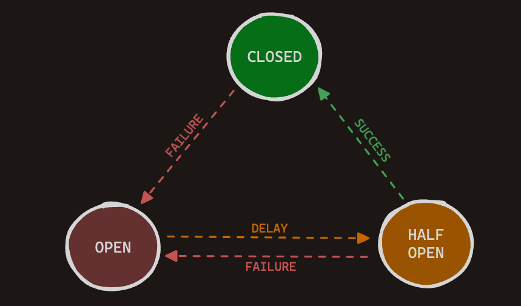

# Go Circuit Breaker



Go Circuit Breaker is a robust and flexible Go package that provides a Circuit Breaker implementation for managing unreliable or slow dependencies in your Go applications. It helps improve the resilience and reliability of your services by preventing cascading failures and allowing graceful handling of failing components.

## Table of Contents

- [Introduction](#introduction)
- [Why Use Circuit Breaker](#why-use-circuit-breaker)
- [Features](#features)
- [Installation](#installation)
- [Usage](#usage)
  - [Getting Started](#getting-started)
  - [Configuration](#configuration)
  - [Fallback Mechanism](#fallback-mechanism)
  - [Auto-Close Feature](#auto-close-feature)
  - [Advanced Usage](#advanced-usage)
- [Example](#example)
- [Contributing](#contributing)
- [License](#license)

## Introduction

A Circuit Breaker is a design pattern widely used in distributed systems to handle failures and prevent them from propagating through the system. It acts as a safety net that can temporarily block requests to a failing service, allowing it to recover before retrying. Go Circuit Breaker simplifies the implementation of this pattern in your Go applications.

## Why Use Circuit Breaker

Here are some compelling reasons to consider using Go Circuit Breaker in your projects:

- **Fault Tolerance**: Circuit Breakers enhance the fault tolerance of your application by intelligently handling unreliable dependencies.

- **Failover Strategy**: They enable graceful failover strategies, such as using cached data or alternative services when a component is unavailable.

- **Efficiency**: Circuit Breakers help reduce the load on your application and external services by avoiding repeated and futile requests.

- **Fallback Handling**: You can define fallback mechanisms to provide a seamless user experience even when primary services are down.

## Features

- Three states: Closed, Half-Open, and Open.
- Configurable thresholds for consecutive failures and successes.
- Auto-close feature to automatically reset the Circuit Breaker.
- Fallback mechanism for graceful failure handling.
- Open duration to control the time a Circuit Breaker stays open.
- Well-documented and tested for reliability.

## Installation

To install Go Circuit Breaker, use the `go get` command:

```sh
go get github.com/Furkan-Gulsen/gocircuit
```

## Usage

### Getting Started

Using Go Circuit Breaker is straightforward. Here's a basic example of how to use it:

```go
import (
    "github.com/Furkan-Gulsen/gocircuit"
)

func main() {
    // Create a Circuit Breaker configuration.
    config := gocircuit.CircuitBreakerConfig{
        FailureThreshold:   5,
        ResetTimeout:       30 * time.Second,
        SuccessThreshold:   3,
        AutoCloseThreshold: 2,
        AutoCloseDuration:  5 * time.Minute,
        OpenDuration:       1 * time.Minute,
    }

    // Create a Circuit Breaker instance.
    cb := gocircuit.NewCircuitBreaker(config, fallbackFunc)

    // Execute an action using the Circuit Breaker.
    err := cb.Execute(myRequestFunc)

    if err != nil {
        // Handle the error or fallback gracefully.
    }
}
```

For a more detailed usage guide, please refer to the [Usage](#usage) section in the README.

### Configuration

You can configure the behavior of the Circuit Breaker by adjusting the following parameters in the `CircuitBreakerConfig` structure:

- `FailureThreshold`: The threshold for consecutive failures required to trip the circuit.
- `ResetTimeout`: The duration after which the circuit transitions to the half-open state.
- `SuccessThreshold`: The threshold for consecutive successes required to reset the circuit.
- `AutoCloseThreshold`: The threshold for consecutive successful executions required to auto-close the circuit.
- `AutoCloseDuration`: The duration after which the circuit automatically closes if the threshold is not met.
- `OpenDuration`: The duration for which the circuit remains open before transitioning to half-open.

### Fallback Mechanism

Go Circuit Breaker allows you to define a fallback mechanism by providing a fallback function. This function will be executed when a request fails. You can use this mechanism to provide alternative functionality or data when a service is unavailable.

```go
func fallbackFunc() error {
    // Implement your fallback logic here.
    return nil
}
```

### Auto-Close Feature

The auto-close feature automatically resets

the Circuit Breaker to the closed state if the specified threshold for consecutive successful executions is met. This feature helps reduce downtime and ensures that the circuit is retested for reliability.

## License

This project is licensed under the MIT License - see the [LICENSE](LICENSE) file for details.
